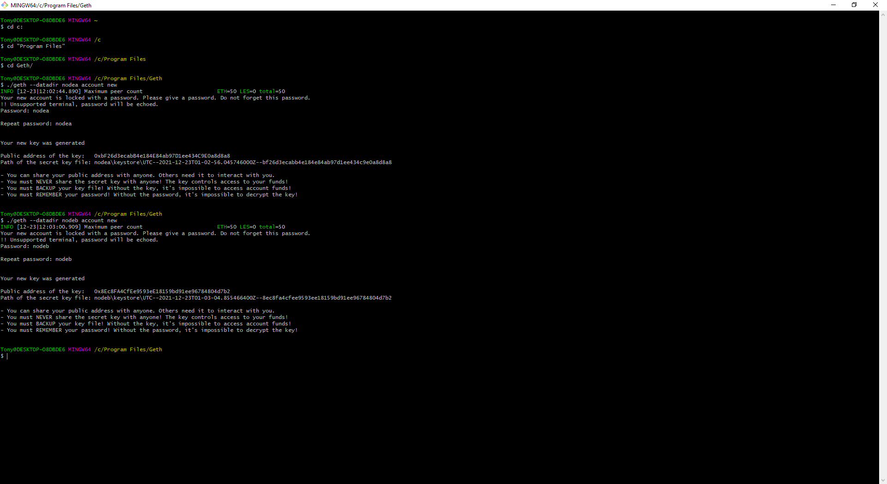
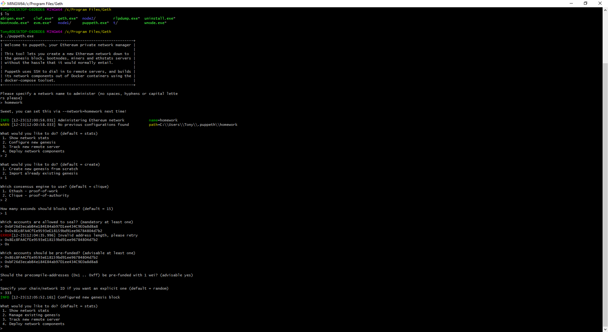
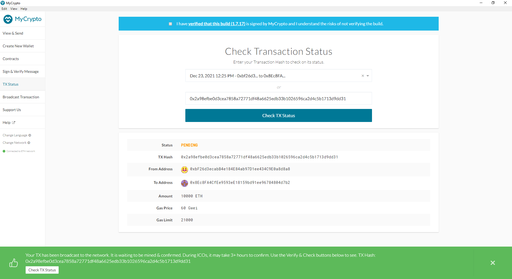
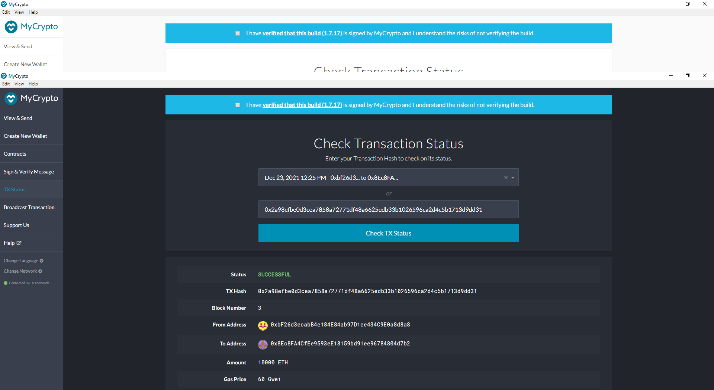

# PoA-Development-Chain

I have developed a Proof of Authority (PoA) development blockchain which will allow you to explore the potential of using blockchain at ZBank.


# Using the Testnet Blockchain
## Creating Nodes

Creating nodes can be done by using this command
```
./geth --datadir node1 account new
./geth --datadir node2 account new
```


It is essential for the nodes to be created before the blockchain as these nodes are the miners used for the proof of authority consensus algorithm. 

## Creating the Genesis Block

Running the puppeth program, the genesis block can be created, we will be using the Clique - Proof of Authority Algorithm and seal the created nodes onto the genesis block.
```
./puppeth
```


The nodes created need to be sealed at this point, as these are the miners that will determine integrity of the transactions on the blockchain.

## Initializing the Nodes

Initialize the nodes with the json file created for the genesis block.
```
./geth --datadir node1 init networkname.json
./geth --datadir node2 init networkname.json
```


## Start Mining!

Now that the nodes and blockchain are configured, you need to set the nodes as miners, so they can mine any transactions that come onto the blockchain.

```
./geth --datadir node1 --unlock "SEALER_ONE_ADDRESS" --mine --rpc --allow-insecure-unlock
./geth --datadir node2 --unlock "SEALER_TWO_ADDRESS" --mine --port 30304 --bootnodes "enode://SEALER_ONE_ENODE_ADDRESS@127.0.0.1:30303" --ipcdisable --allow-insecure-unlock
```
### Node A Mining

### Node B Mining


## Sending Transactions

We will be sending transactions using MyCrypto GUI with the exposed RPC Port

You will need to use a custom network, and include the chain ID, and use ETH as the currency.


Import the keystore file from the node1/keystore directory into MyCrypto. This will import the private key.

Send a transaction from the node1 account to the node2 account.



